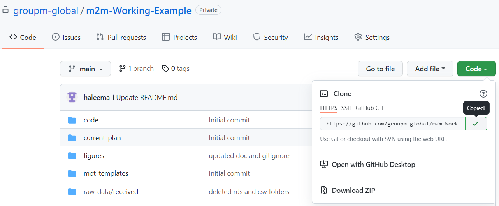
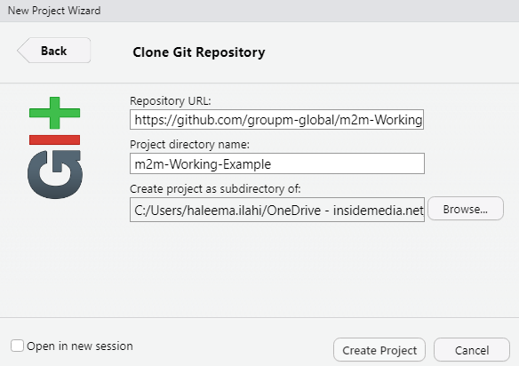

# M2M Working Example

The goal of m2m is to take the typical output of MMMs and populating an MOT with the data. This project contains the working example.

## Installation

### m2m

You will need to have already installed the released version of m2m from [here](https://github.com/groupm-global/m2m). If you have not you can do so with the below commands. You will need to have created and configured your personal access token, if you have not already done this please get in touch with a member of the team.

``` r
library(devtools)
library(git2r)
library(gitcreds)

devtools::install_github(
  "https://github.com/groupm-global/m2m",
  ref = "main",
  build_vignettes = TRUE,
  auth_token = gitcreds_get()$password)
```
### Working example

To save the project locally you first need to copy the URL from GitHub:

* You can find the HTTPS URL from the project homepage

<br>
<br>

Next in your RStudio you need to create a new project:

* File > New Project > Version Control > Git
* Then paste the HTTPS URL in the Repository URL

<br>
<br>

You should now see all the files that were on the remote repository in your project folder.


## How to Use?

In this working example we use an edited Costa dataset, however the workflow is the same. There are two types of comments, anything beginning with #' help to explain the overall process. All other comments are specific to Costa in the same way you would comment your own work.

The main scripts you will need to run are are found in ``./code``. The output of each of those scripts are saved in ``./intermediate_steps``. The data to use is found in ``./raw_data``, the ``./raw_data/received`` folder contains the output of the JEET tool which we format into the inputs we need in ``./code/0-data-prep.R``.

Credits
Thank you to Asher & Nick for doing most of the work on this!
